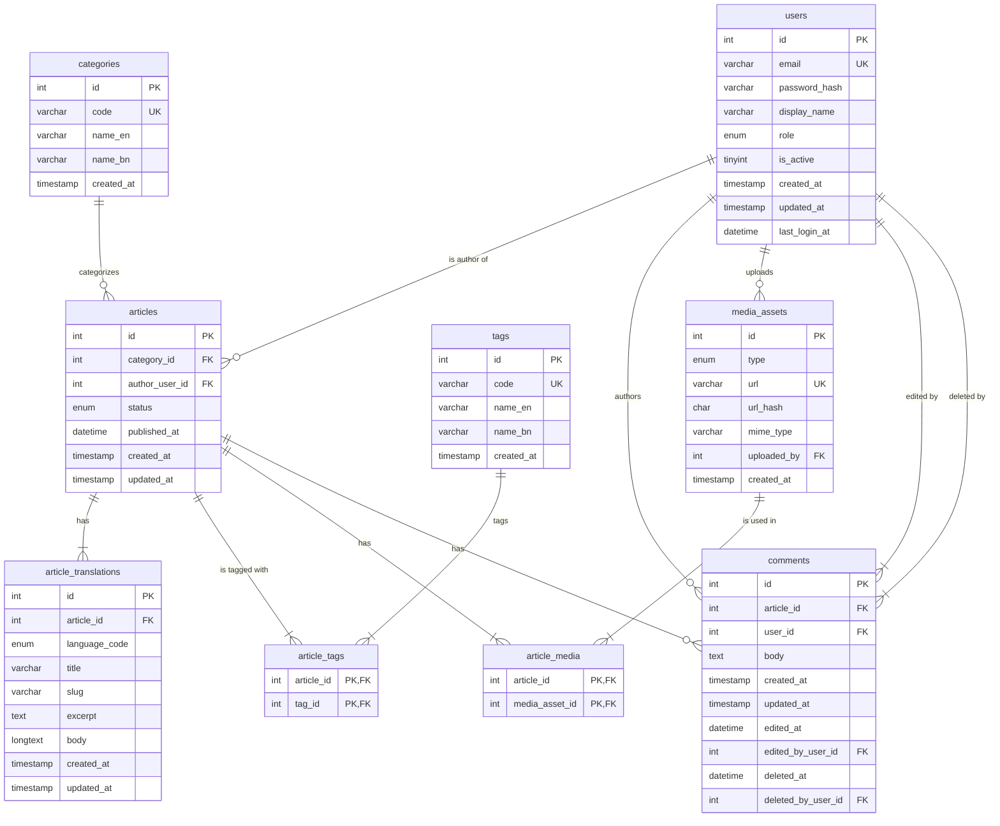

# Database Documentation
**Authors:** Thilina Randew Kumarasinghe, Nikitha Vicum Bamunuarachchige

## 1. Introduction

This document provides a detailed overview of the MySQL database schema for the COS40006 Project B Backend Server. It includes an Entity-Relationship (ER) diagram, detailed descriptions of each table, and notes on indexing and relationships.

## 2. Entity-Relationship (ER) Diagram

The following diagram illustrates the relationships between the tables in the database.

## 3. Table Schemas

### 3.1. `users`

Stores user account information for authentication, authorization, and content attribution.

| Column | Type | Constraints | Description |
| :--- | :--- | :--- | :--- |
| **id** | `int` | PK, AI | Unique identifier for the user. |
| email | `varchar(191)` | UK | User's email address, used for login. Must be unique. |
| password_hash | `varchar(255)` | | Hashed password for security. |
| display_name | `varchar(255)` | | Publicly visible name of the user. |
| role | `enum(...)` | | User's role (`admin`, `editor`, `reader`), determining permissions. |
| is_active | `tinyint(1)` | | Flag to enable/disable the account (1 for active, 0 for inactive). |
| created_at | `timestamp` | | Timestamp of when the user account was created. |
| updated_at | `timestamp` | | Timestamp of the last update to the user's record. |
| last_login_at | `datetime` | | Timestamp of the user's last login. |

### 3.2. `categories`

Defines the primary, stable taxonomy for articles.

| Column | Type | Constraints | Description |
| :--- | :--- | :--- | :--- |
| **id** | `int`| PK, AI | Unique identifier for the category. |
| code | `varchar(64)` | UK | A stable, URL-friendly code for the category. |
| name_en | `varchar(255)` | | English name of the category. |
| name_bn | `varchar(255)` | | Bengali name of the category. |
| created_at | `timestamp` | | Timestamp of when the category was created. |

### 3.3. `articles`

The core content container, linking together translations, metadata, and authors.

| Column | Type | Constraints | Description |
| :--- | :--- | :--- | :--- |
| **id**| `int` | PK, AI | Unique identifier for the article. |
| category_id | `int` | FK to `categories.id` | The primary category this article belongs to. |
| author_user_id | `int` | FK to `users.id` | The user who authored the article. |
| status | `enum(...)` | | The current state of the article (`draft`, `published`, `hidden`). |
| published_at | `datetime`| | Timestamp of when the article was published. `NULL` if not published. |
| created_at | `timestamp` | | Timestamp of when the article was created. |
| updated_at | `timestamp` | | Timestamp of the last update. |

### 3.4. `article_translations`

Stores the language-specific content for each article.

| Column | Type | Constraints | Description |
| :--- | :--- | :--- | :--- |
| **id** | `int` | PK, AI | Unique identifier for the translation. |
| article_id | `int` | FK to `articles.id` | The article this translation belongs to. |
| language_code | `enum('en','bn')` | | Language of this translation (`en` or `bn`). |
| title | `varchar(255)` | | The title of the article in this language. |
| slug | `varchar(255)` | UK (with `language_code`) | URL-friendly version of the title. |
| excerpt | `text` | | A short summary of the article. |
| body | `longtext` | | The full content of the article. |
| created_at | `timestamp` | | Timestamp of when the translation was created. |
| updated_at | `timestamp` | | Timestamp of the last update. |

### 3.5. `tags`

Provides a flexible, secondary way to classify articles.

| Column | Type | Constraints | Description |
| :--- | :--- | :--- | :--- |
| **id** | `int` | PK, AI | Unique identifier for the tag. |
| code | `varchar(64)` | UK | A stable, URL-friendly code for the tag. |
| name_en | `varchar(255)` | | English name of the tag. |
| name_bn | `varchar(255)` | | Bengali name of the tag. |
| created_at | `timestamp` | | Timestamp of when the tag was created. |

### 3.6. `article_tags`

A junction table to create a many-to-many relationship between `articles` and `tags`.

| Column | Type | Constraints | Description |
| :--- | :--- | :--- | :--- |
| **article_id** | `int` | PK, FK to `articles.id` | The article being tagged. |
| **tag_id** | `int` | PK, FK to `tags.id` | The tag being applied. |

### 3.7. `media_assets`

A registry for all uploaded media files (images and videos).

| Column | Type | Constraints | Description |
| :--- | :--- | :--- | :--- |
| **id** | `int` | PK, AI | Unique identifier for the media asset. |
| type | `enum('image','video')` | | The type of media. |
| url | `varchar(2048)`| UK | The public URL of the media file. |
| url_hash | `char(64)` | | A hash of the URL to prevent duplicates. |
| mime_type | `varchar(128)`| | The MIME type of the file (e.g., `image/jpeg`). |
| uploaded_by | `int` | FK to `users.id` | The user who uploaded the file. |
| created_at | `timestamp` | | Timestamp of when the asset was uploaded. |

### 3.8. `article_media`

A junction table to create a many-to-many relationship between `articles` and `media_assets`.

| Column | Type | Constraints | Description |
| :--- | :--- | :--- | :--- |
| **article_id** | `int` | PK, FK to `articles.id` | The article using the media. |
| **media_asset_id** | `int`| PK, FK to `media_assets.id` | The media asset being used. |

### 3.9. `comments`

Stores user-submitted comments on articles.

| Column | Type | Constraints | Description |
| :--- | :--- | :--- | :--- |
| **id**| `int` | PK, AI | Unique identifier for the comment. |
| article_id | `int` | FK to `articles.id` | The article the comment was posted on. |
| user_id | `int` | FK to `users.id` | The user who posted the comment. |
| body | `text` | | The content of the comment. |
| created_at | `timestamp` | | Timestamp of when the comment was posted. |
| updated_at | `timestamp` | | Timestamp of the last update. |
| edited_at | `datetime` | | Timestamp of when the comment was last edited. |
| edited_by_user_id | `int` | FK to `users.id` | The user who last edited the comment. |
| deleted_at | `datetime` | | Timestamp for soft deletion. |
| deleted_by_user_id| `int` | FK to `users.id` | The user who soft-deleted the comment. |

## 4. Indexes and Constraints

-   **Primary Keys:** Each table has a primary key `id` (or a composite key for junction tables) for unique identification.
-   **Foreign Keys:** Foreign keys (FK) are used to enforce referential integrity between tables.
-   **Unique Keys (UK):** Fields like `email`, `code`, and `url` are unique to prevent duplicate entries.
-   **Full-text Indexes:** A full-text index on `article_translations(title, excerpt, body)` is recommended to optimize search performance.
